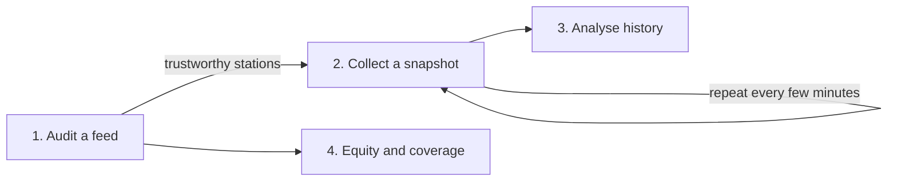

# Examples

Four worked, end-to-end scripts, in the order you would actually meet them: audit an unknown
feed, collect snapshots into a data lake, analyse the resulting history, then measure network
equity. Each has its own page with a step-by-step walkthrough, the command to run it, and the full
source.

## Workflow



Auditing comes first, because every later step should run on the trustworthy subset of stations.
Collection is repeated on a schedule to build a panel; analysis and the equity report then read
from what was collected.

| Example | Goal | Extras |
|---|---|---|
| [Audit a feed](examples/01-audit-a-feed.md) | Inspect an unknown feed and keep the trustworthy stations | `[fetch]` |
| [Collect a snapshot](examples/02-collect-a-snapshot.md) | One cron-driven collection run into a Parquet lake | `[fetch]`, `[parquet]` |
| [Analyse history](examples/03-analyze-history.md) | Coverage, daily typologies and turnover from a built-up lake | `[parquet]`, `[cluster]` |
| [Equity and coverage](examples/04-equity-and-coverage.md) | Capacity concentration and spatial equity of a network | `[fetch]`, `[geo]` |
| [Rigorous audit](examples/05-rigorous-audit.md) | Verdict + threshold robustness + bootstrap CIs + FDR-controlled hotspots | none (bundled data) |
| [Equity, accessibility & rebalancing](examples/06-equity-rebalancing.md) | Theil/Palma, E2SFCA, Wasserstein rebalancing tension, observability loss | `[geo]` |
| [Free-floating & ghost fleets](examples/07-free-floating-fleets.md) | Reconcile docked + free-floating, ghost vehicles, spatial-entropy collapse | none (synthetic) |
| [Service reliability](examples/08-service-reliability.md) | Stockout episodes, Kaplan–Meier outage survival, sampling vulnerability | none (synthetic) |
| [Contextualize with transit & weather](examples/09-contextualize.md) | Transit feeders, leak-free exogenous join, autocorrelation | none (synthetic) |
| [Macro-scale comparative audit](examples/10-macro-scale-audit.md) | Filter the world catalogue and audit N feeds in one call | `[fetch]` (live) |

The last two scenarios use the bundled `load_example()` dataset and small synthetic
frames, so they run with no network and are executed in CI.

Install what a script needs, for example:

```bash
pip install "gbfs-toolkit[fetch,parquet,cluster,geo]"
```

The runnable `.py` files live in the
[`examples/`](https://github.com/cycling-data-lab/gbfs-toolkit/tree/main/examples) directory of the
repository. For instant, network-free reproduction, a
[quickstart notebook](notebooks/quickstart.ipynb) runs the audit, occupancy and a descriptive
profile on the bundled sample.

## Finding a system id

Examples `02` and `03` resolve a system by its MobilityData catalogue id (`velib`,
`bike_share_toronto`, and so on). Examples `01` and `04` take a `gbfs.json` URL directly. To find
an id:

```python
import gbfs_toolkit as gb

cat = gb.systems_catalog()
gb.filter_catalog(cat, country_code="FR")[["system_id", "name"]]
```

!!! note "Feeds change without notice"
    GBFS feeds are operator-run. A URL that worked last month may move or break, and the exact
    fields a feed publishes vary by operator and GBFS version. The audit is designed to make those
    differences visible rather than to assume them away.
